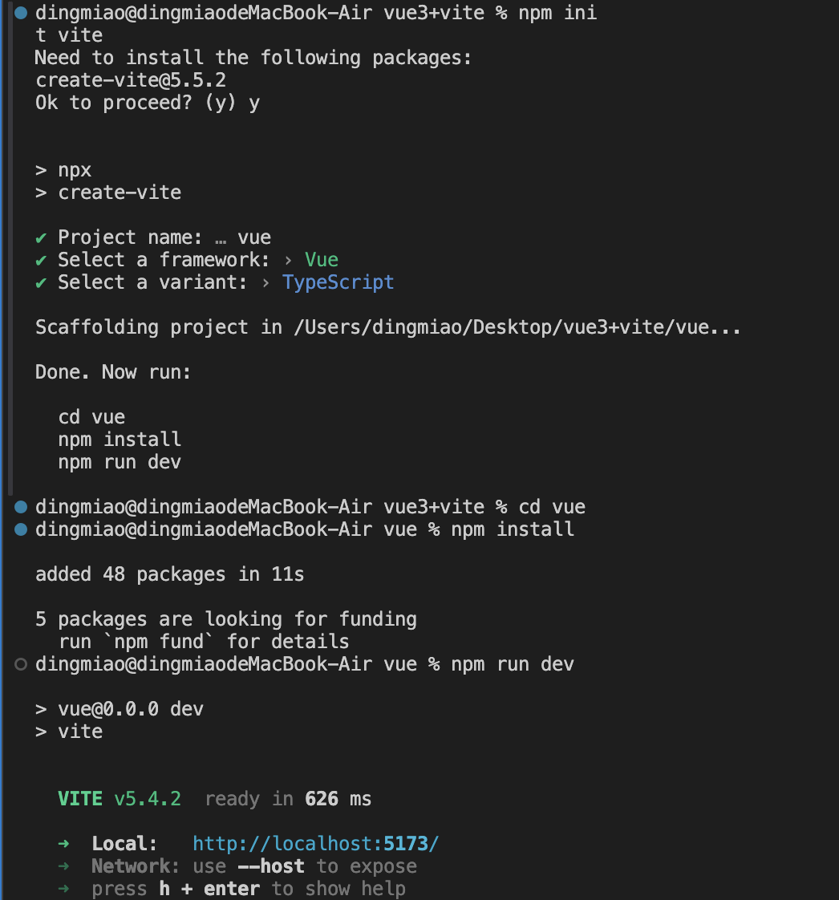

# vite + vue3 项目环境搭建
## 什么是Vite
Vite 是一个web开发构建工具，由于其原生ES模块导入方法，它允许凯苏提供代码，在开发环境下基于浏览器原生ES imports 开发，在生产环境下基于Rollup打包。

通过在终端中运行一下命令，可以使用Vite快速构建VUE项目比webpack打包更加快速。

它主要具有以下特点：
1、快速的冷启动；
2、即时的模块热更新；
3、真正的按需编译；

## 创建vite3项目
输入命令 npm init vite
在Project name选项中输入项目名称

cd vue 进入项目中
安装依赖 npm install 
运行vite项目 输入 npm run dev

vite.config.json文件:
设置自动浏览 